# TaiShang - AI驱动的加密货币交易系统

TaiShang是一个基于Google Gemini AI的自动化加密货币交易系统，专门设计用于OKX交易所的交易。系统结合了技术分析、市场数据和AI决策支持，提供智能化的交易执行服务。

## 主要特性

- 🤖 AI驱动的交易决策（基于Google Gemini 2.5）
- 📊 自动化技术分析和市场数据收集
- 📈 TradingView图表自动截图和分析
- 💹 自动化交易执行（开仓/平仓）
- ⚡ 实时市场监控和风险控制
- 📝 详细的交易日志和分析报告

## 系统架构

```mermaid
graph TD
    A["太熵量化交易系统<br/>Taishang System"] --> B["主控模块<br/>src/main.py"]
    B --> C["数据服务器<br/>src/data_server.py"]
    B --> D["数据收集模块<br/>src/main_get.py"]
    B --> E["AI决策模块<br/>src/MES/"]
    B --> F["交易执行模块<br/>src/auto_trader.py"]
    
    C --> C1["Chrome浏览器自动化"]
    C --> C2["截图服务API"]
    C --> C3["FGI缓存管理"]
    
    D --> D1["技术指标收集<br/>technical_indicator_collector.py"]
    D --> D2["宏观因子收集<br/>macro_factor_collector.py"]
    D --> D3["持仓信息获取<br/>get_positions.py"]
    D --> D4["TradingView截图<br/>tradingview_auto_screenshot.py"]
    
    D1 --> D1A["RSI/MACD/EMA/布林带"]
    D1 --> D1B["ATR/ADX/Stoch/VWAP"]
    D2 --> D2A["恐惧贪婪指数"]
    D2 --> D2B["资金费率"]
    D2 --> D2C["持仓量"]
    D3 --> D3A["OKX API"]
    D3 --> D3B["账户余额/持仓/订单"]
    
    E --> E1["Controller<br/>gemini_Controller.py"]
    E --> E2["Critic<br/>gemini_Critic.py"]
    E1 --> E1A["Google Gemini API"]
    E1 --> E1B["多轮对话管理"]
    E1 --> E1C["工具函数调用"]
    
    F --> F1["OKX交易API"]
    F --> F2["订单管理"]
    F --> F3["风险控制"]
    
    G["配置管理<br/>config/config.json"] --> B
    H["日志系统<br/>logs/"] --> B
    I["功能模块<br/>function/"] --> E
    
    I --> I1["K线形态分析<br/>kline_pattern_analyzer.py"]
    I --> I2["交易历史<br/>get_transaction_history.py"]
    I --> I3["交易工具<br/>trade/"]
    
    J["外部服务"] --> J1["OKX交易所"]
    J --> J2["Google Gemini AI"]
    J --> J3["TradingView"]
    J --> J4["Alternative.me FGI API"]
```



### 主要模块说明

1. **主控模块 (main.py)** - 系统入口，协调各模块运行
2. **数据服务器 (data_server.py)** - 提供数据服务和浏览器自动化功能
3. **数据收集模块 (main_get.py)** - 收集市场数据和技术指标
4. **AI决策模块 (MES/)** - 基于Gemini AI的交易决策系统
5. **交易执行模块 (auto_trader.py)** - 执行交易指令和风险管理
6. **配置管理 (config.json)** - 系统参数和API密钥配置
7. **日志系统 (logs/)** - 记录系统运行状态和交易历史
8. **功能模块 (function/)** - 提供各种交易分析工具

## 安装指南

1. 克隆仓库
```bash
git clone [repository-url]
cd taishang
```

2. 安装依赖
```bash
pip install -r requirements.txt
```

3. 配置系统
- 复制`config/config.json.example`到`config/config.json`
- 填写必要的配置信息：
  * OKX API凭证
  * Gemini API密钥
  * 代理设置（如需要）
  * 其他系统参数

## 配置说明

### 1. 交易配置
```json
{
    "instId": "ETH-USDT-SWAP",  // 交易对
    "okx": {
        "api_key": "your-api-key",
        "secret_key": "your-secret-key",
        "passphrase": "your-passphrase"
    }
}
```

### 2. AI模型配置
```json
{
    "MODEL_CONFIG": {
        "MODEL_NAME": "gemini-2.5-flash-preview-05-20",
        "default_temperature": 0.0,
        "default_top_p": 0.95,
        "default_max_output_tokens": 24576
    }
}
```

### 3. 系统路径配置
```json
{
    "data_path": "data/data.json",
    "main_log_path": "logs/main.log",
    "cache_screenshot_path": "data/cache_screenshot"
}
```

## 使用指南

1. 启动系统
```bash
python src/main.py
```

2. 监控交易
- 查看`logs/main.log`获取系统运行状态
- 查看`logs/trade_history.json`获取交易历史
- 查看`logs/think_log.md`获取AI决策过程

## 安全提示

1. API密钥安全
- 不要在代码中硬编码API密钥
- 使用环境变量或加密配置文件存储敏感信息
- 定期更换API密钥

2. 风险控制
- 设置合理的交易限额
- 启用止损保护
- 定期检查系统日志

## 开发指南

### 项目结构
```
taishang/
├── config/                 # 配置文件
├── data/                   # 数据文件
├── function/              # 核心功能模块
│   ├── trade/            # 交易相关功能
│   └── utils/            # 工具函数
├── logs/                  # 日志文件
├── src/                   # 源代码
│   ├── MES/              # AI模型相关
│   └── get_data/         # 数据收集模块
└── tests/                # 测试文件
```

### 添加新功能
1. 在相应模块目录下创建新文件
2. 更新配置文件（如需要）
3. 添加单元测试
4. 更新文档

## 注意事项

- 系统需要稳定的网络连接
- 建议使用虚拟环境运行
- 定期备份配置和日志文件
- 监控系统资源使用情况

## 贡献指南

1. Fork 项目
2. 创建功能分支
3. 提交更改
4. 发起 Pull Request

## 许可证

[添加许可证信息]

## 免责声明

本系统仅供学习和研究使用。使用本系统进行实际交易时，请注意风险控制，作者不对任何交易损失负责。