# TaiShang - AI驱动的加密货币量化交易系统

TaiShang是一个基于Google Gemini AI的自动化加密货币交易系统，专门设计用于OKX交易所的交易。系统结合了技术分析、市场数据和AI决策支持，提供智能化的交易执行服务。

## 主要特性

- 🤖 AI驱动的交易决策（基于Google Gemini）
- 📊 自动化技术分析和市场数据收集
- 📈 实时K线模式识别和趋势分析
- 💹 自动化交易执行（开仓/平仓）
- ⚡ 实时市场监控和风险控制
- 📝 详细的交易日志和分析报告

## 系统架构

```mermaid
graph TD
    %% 系统启动与主循环
    A[系统启动] --> B[主循环: 每30分钟执行]
    
    %% 初始化流程
    subgraph "初始化流程"
        A --> InitEnv[环境检查]
        InitEnv --> InitConfig[配置加载与验证]
        InitConfig --> InitAPI[API密钥验证]
        InitAPI --> InitLog[日志系统初始化]
        InitLog --> InitService[服务启动]
        InitService --> InitAI[AI模型初始化]
    end

    %% 数据获取流程
    subgraph "数据获取"
        B --> C[数据获取阶段]
        C --> C1[获取持仓信息]
        C --> C2[获取市场数据]
        C2 --> C3[初始化截图驱动]
        C1 & C2 & C3 --> C4[整合数据]
    end

    %% 数据处理流程
    subgraph "数据处理"
        C4 --> D[数据处理阶段]
        D --> D1[数据分析输入]
        D1 --> D2[特征计算]
        D1 --> D3[信息预处理]
        D2 & D3 --> D4[分析输出]
    end

    %% AI决策流程
    subgraph "AI决策"
        D4 --> E[决策流程]
        E --> E1[策略制定（决策者）]
        E1 --> E2[策略审查（谏官）]
        E2 -->|通过| F[风险管理（风险管理员）]
        E2 -->|不通过| E1
    end

    %% 交易执行流程
    subgraph "交易执行"
        F --> G[执行流程]
        G --> G1[订单校验]
        G1 --> G2[交易操作]
        G2 --> G3[日志记录]
        G3 --> G4[结果记录]
        G4 --> G5[状态通知]
    end

    %% 外部系统交互
    G2 --> H[OKX API调用]
    H --> G3

    %% 反馈循环
    G5 --> B
    G3 --> I[历史记录]
    I --> PerfEval[绩效评估（绩效评估专家）]
    PerfEval --> E1
```


### 核心模块说明

1. **主控模块 (main.py)** - 系统入口点，初始化并启动各子系统
2. **核心控制器 (main_controller.py)** - 系统主控制器，管理运行模式和模块协调
3. **数据收集服务 (collector_service.py)** - 整合技术指标、宏观因子和持仓数据收集
4. **AI决策模块 (gemini_controller.py)** - 基于Gemini AI的交易策略生成系统
5. **交易执行引擎 (auto_trader.py)** - 执行交易指令、管理订单和风险控制
6. **K线模式分析** - 识别K线形态和趋势
7. **基础设施服务** - 提供Web服务等基础设施支持

## 安装指南

1. 克隆仓库
```bash
git clone [repository-url]
cd taishang
```

2. 创建并激活虚拟环境（推荐）
```bash
python -m venv venv
source venv/bin/activate  # Linux/Mac
venv\Scripts\activate     # Windows
```

3. 安装依赖
```bash
pip install -r requirements.txt
```

4. 配置系统
- 复制`config/config.json.example`到`config/config.json`
- 填写必要的配置信息：
  * OKX API凭证（api_key, secret_key, passphrase）
  * Gemini API密钥（在MODEL_CONFIG部分）
  * 代理设置（如需要）
  * 数据文件路径配置
  * 日志文件路径配置

## 使用指南

### 命令行选项

您可以通过丰富的命令行参数来控制系统的行为。

| 参数 (长) | 参数 (短) | 描述 | 默认值/可选值 | 示例用法 |
| :--- | :--- | :--- | :--- | :--- |
| `--debug` | `-d` | **调试模式**：立即执行一次完整的交易流程（数据采集 -> AI决策 -> 交易执行）后退出。 | - | `uv run src/core/main_controller.py --debug` |
| `--debug-loop` | | **调试循环模式**：连续执行交易流程，跳过每个循环之间的等待时间，用于快速迭代测试。 | - | `uv run src/core/main_controller.py --debug-loop` |
| `--dry-run` | | **模拟运行模式**：执行所有步骤，但不会实际下单交易。所有交易指令将被打印到日志，用于安全测试策略。 | - | `uv run src/core/main_controller.py --dry-run` |
| `--think` | | **思考摘要模式**：在AI决策时，实时打印模型的思考过程（绿色）和最终输出（米色），用于深入调试AI行为。 | - | `uv run src/core/main_controller.py --think` |
| `--log-level` | | **日志级别**：设置日志记录的详细程度。 | `INFO` (默认), `DEBUG`, `WARNING`, `ERROR` | `uv run src/core/main_controller.py --log-level DEBUG` |
| `--config` | | **指定配置文件**：使用自定义的 `config.json` 文件路径，而不是默认的 `config.json`。 | `config.json` | `uv run src/core/main_controller.py --config /path/to/my_config.json` |
| `--skip-server` | | **跳过服务器启动**：假设数据采集服务已在后台运行，主控制器将不再尝试启动它。 | - | `uv run src/core/main_controller.py --skip-server` |
| `--help-debug` | | **显示调试帮助**：打印关于不同调试模式和参数组合的详细说明。 | - | `uv run src/core/main_controller.py --help-debug` |


### 启动系统

基本启动（生产模式）：
```bash
uv run src/core/main_controller.py
```

#### 组合用法示例
```bash
# 使用DEBUG日志级别进行一次模拟运行，并查看AI的详细思考过程
uv run src/core/main_controller.py --debug --dry-run --think --log-level DEBUG
```

#### 旧版启动方式 (如果适用)
```bash
python src/main.py
```

### 系统模式
- **生产模式**：执行真实交易（默认模式）。
- **模拟运行模式**：不执行真实交易，用于测试（使用`--dry-run`）。
- **调试模式**：用于开发和快速测试（使用`--debug`或`--debug-loop`）。

### 监控交易
- 查看 `logs/main.log` 获取系统运行状态。
- 查看 `logs/trade_history.json` 获取交易历史
- 查看 `logs/ai_decisions.md` 获取AI决策过程

## 开发指南

### 项目结构
```
taishang/
├── config/                 # 配置文件
├── data/                   # 数据文件
├── src/                    # 源代码
│   ├── ai/                # AI相关模块
│   ├── core/              # 核心控制逻辑
│   ├── data/              # 数据收集服务
│   ├── infrastructure/    # 基础设施
│   ├── trading/           # 交易执行模块
│   └── main.py            # 系统入口
├── logs/                  # 日志文件
└── tests/                 # 测试代码
```

## 安全提示

1. API密钥安全
- 使用环境变量或加密配置文件存储敏感信息
- 设置最小必要权限的API密钥
- 定期更换API密钥

2. 风险控制
- 设置合理的交易限额
- 启用止损保护
- 定期检查系统日志

```mermaid
graph TD
    A[AI决策] --> B[谏官审查]
    B --> C{审查结果}
    C -->|通过| D[执行交易]
    C -->|失败| E[提取谏官反馈]
    E --> F[生成具体修正提示词]
    F --> G[重新决策]
    D --> H{交易结果}
    H -->|成功| I[完成]
    H -->|失败| J[生成执行失败提示词]
    J --> G
    G --> A
```


