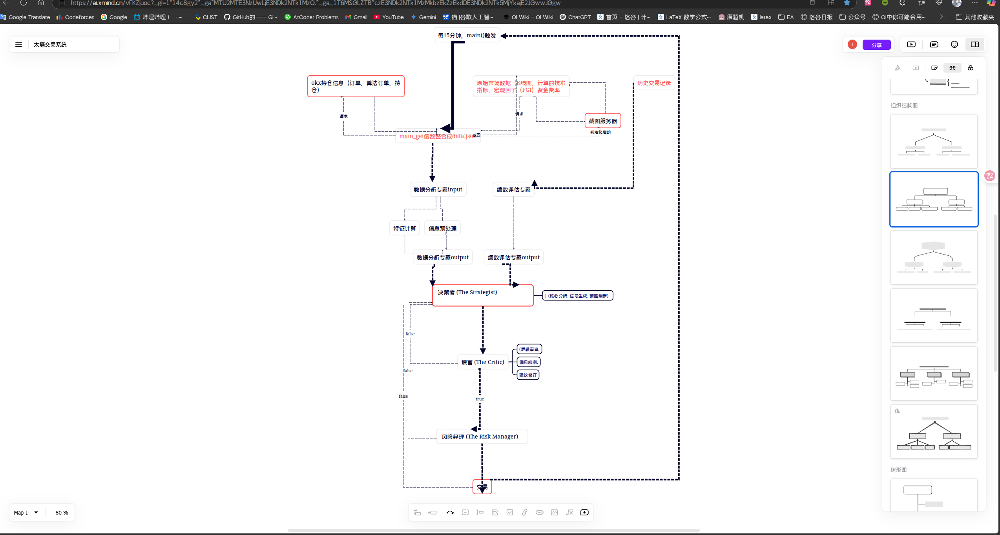

<todo>
1.增加重试机制，增强健壮性，当交易系统报错时，尝试让大模型重新生成1遍，如果仍然报错，发送电子邮件，然后等待下次交易。
2.分析这个系统的分支图，增加模块化，增加可扩展性，增加可维护性。
3.增加RAG知识库。
4.逐步完成思维导图的内容，
5.系统中留出判别形模型的位置，并留出接口，方便后续添加判别形模型。（后续我会将模型的结果当作因子，添加到系统中）
6.另外系统名叫"太熵"
</todo>
<prompt>
你需要扫描整个项目，列出思维导图A，然后根据思维导图A结合4.的思维导图，列出思维导图B，
然后在todo.md后添加的todo.md后添加思维导图B的图片，并更新todo.md文件。
然后根据<todo>的内容列出一个可行性方案（越详细越好），并更新todo.md文件。（更新为在原有内容上添加）,

</prompt>


---

## 🧠 思维导图B - 太熵系统流程优化架构

基于系统运行日志分析和todo需求，重新设计的流程化架构图已生成（Mermaid图表）

### 🎯 核心流程改进点

1. **系统启动流程优化** - 环境检查→配置加载→服务启动的标准化流程
2. **数据收集流程增强** - 预处理→采集→整合的三阶段数据处理
3. **AI决策流程改进** - 数据预处理→模型推理→结果融合的智能决策链
4. **交易执行流程完善** - 订单预检→交易执行→结果记录的安全交易流程
5. **循环监控流程** - 时间触发→异常监控→通知机制的持续监控体系
6. **容错重试机制** - AI重试、交易重试、数据重试的多层保障

---

## 📋 详细可行性实施方案

### 🔄 1. 重试机制和健壮性增强

#### 1.0 Chrome启动问题修复（紧急）
**问题分析：**
从系统日志可见Chrome浏览器初始化时出现`KeyboardInterrupt`错误，导致`data_server.py`启动失败。

**立即修复方案：**
- [ ] 添加Chrome启动超时检测（当前无限等待）
- [ ] 实现Chrome启动失败后的重试机制
- [ ] 优化Chrome配置参数，减少启动时间
- [ ] 添加无头浏览器备用方案

**技术实现：**
```python
def initialize_browser_with_retry(max_retries=3, timeout=30):
    for attempt in range(max_retries):
        try:
            signal.alarm(timeout)  # 设置超时
            driver = uc.Chrome(options=chrome_options, headless=True)
            signal.alarm(0)  # 取消超时
            return driver
        except Exception as e:
            logger.warning(f"Chrome启动失败 (第{attempt+1}次): {e}")
            if attempt < max_retries - 1:
                time.sleep(2 ** attempt)  # 指数退避
            else:
                # 启用备用浏览器方案
                return init_firefox_driver()
```

**优先级：** 🔴 紧急
**预估工期：** 1-2天

#### 1.1 AI模型重试机制
**实施步骤：**
- [ ] 创建 `src/core/retry_manager.py` 模块
- [ ] 在 `gemini_Controller.py` 中集成重试逻辑
- [ ] 实现指数退避算法（1s, 2s, 4s, 8s）
- [ ] 添加API密钥轮换机制

**技术细节：**
```python
class RetryManager:
    def __init__(self, max_retries=3, backoff_factor=2):
        self.max_retries = max_retries
        self.backoff_factor = backoff_factor
    
    def retry_with_backoff(self, func, *args, **kwargs):
        # 实现重试逻辑
        pass
```

#### 1.2 邮件通知系统
**实施步骤：**
- [ ] 创建 `src/notification/email_notifier.py`
- [ ] 集成SMTP配置到 `config.json`
- [ ] 实现异常级别分类（警告/错误/严重）
- [ ] 添加邮件模板系统

**优先级：** 🔴 高
**预估工期：** 3-5天

### 🏗️ 2. 系统模块化重构

#### 2.1 分层架构实现
**重构计划：**
```
src/
├── core/                    # 核心层
│   ├── main_controller.py   # 主控制器
│   ├── retry_manager.py     # 重试管理
│   └── exception_handler.py # 异常处理
├── data/                    # 数据层
│   ├── collectors/          # 数据收集器
│   ├── storage/            # 数据存储
│   └── rag/                # RAG知识库
├── ai/                      # AI决策层
│   ├── models/             # 模型管理
│   ├── fusion/             # 决策融合
│   └── interfaces/         # 模型接口
├── trading/                 # 交易执行层
│   ├── engine/             # 交易引擎
│   ├── risk/               # 风险管理
│   └── position/           # 仓位管理
└── infrastructure/          # 基础设施层
    ├── config/             # 配置管理
    ├── monitoring/         # 监控告警
    └── logging/            # 日志系统
```

#### 2.2 插件化架构
**实施步骤：**
- [ ] 设计插件接口规范
- [ ] 实现插件管理器
- [ ] 创建示例插件
- [ ] 编写插件开发文档

**优先级：** 🟡 中
**预估工期：** 10-15天

### 📚 3. RAG知识库系统

#### 3.1 知识库架构设计
**组件清单：**
- **市场知识库**：历史行情数据、市场事件
- **交易策略库**：成功案例、失败案例
- **风险案例库**：风险事件、应对策略
- **向量检索引擎**：支持语义搜索

#### 3.2 技术实现方案
**技术栈选择：**
- **向量数据库**：Chroma / Weaviate / Qdrant
- **嵌入模型**：OpenAI text-embedding-3-small
- **文档处理**：LangChain / LlamaIndex

**实施步骤：**
- [ ] 搭建向量数据库环境
- [ ] 实现文档切分和向量化
- [ ] 开发检索接口
- [ ] 集成到AI决策流程

**优先级：** 🟢 中高
**预估工期：** 7-10天

### 🤖 4. 判别模型接口系统

#### 4.1 模型接口设计
**接口规范：**
```python
class DiscriminativeModelInterface:
    def predict(self, features: Dict) -> Dict:
        """预测接口"""
        pass
    
    def get_confidence(self) -> float:
        """置信度获取"""
        pass
    
    def get_feature_importance(self) -> Dict:
        """特征重要性"""
        pass
```

#### 4.2 因子管理系统
**实施计划：**
- [ ] 创建 `src/ai/factors/` 目录
- [ ] 实现因子标准化器
- [ ] 开发因子权重管理
- [ ] 集成模型结果融合器

**技术特点：**
- 支持多种模型类型（树模型、深度学习、传统ML）
- 自动特征标准化和归一化
- 动态权重调整机制
- 模型性能监控

**优先级：** 🟡 中
**预估工期：** 8-12天

### 📊 5. 监控和可扩展性增强

#### 5.1 监控告警系统
**功能规划：**
- [ ] 系统性能监控（CPU、内存、网络）
- [ ] 交易异常监控（延迟、失败率）
- [ ] AI模型监控（准确率、响应时间）
- [ ] 实时告警通道（邮件、钉钉、企微）

#### 5.2 配置管理中心
**改进内容：**
- [ ] 环境隔离（开发/测试/生产）
- [ ] 动态配置热更新
- [ ] 配置版本控制
- [ ] 敏感信息加密存储

**优先级：** 🟢 中高
**预估工期：** 5-8天

---

## 🚀 实施优先级和时间线

### Phase 0: 紧急问题修复（1-2天）
1. 🔴 Chrome启动问题修复
2. 🔴 数据服务器稳定性增强
3. 🔴 系统启动流程优化

### Phase 1: 基础稳定性（2-3周）
1. ✅ 全面重试机制实现
2. ✅ 邮件通知系统
3. ✅ 异常处理优化
4. ✅ 日志系统完善

### Phase 2: 架构重构（3-4周）
1. ✅ 分层架构实现
2. ✅ 模块化拆分
3. ✅ 插件系统开发
4. ✅ 配置管理升级

### Phase 3: 智能化增强（2-3周）
1. ✅ RAG知识库搭建
2. ✅ 判别模型接口
3. ✅ 决策融合器
4. ✅ 性能优化

### Phase 4: 监控和运维（1-2周）
1. ✅ 监控告警系统
2. ✅ 性能分析工具
3. ✅ 运维自动化
4. ✅ 文档完善

---

## 💡 技术风险评估

### 🔴 高风险项
- **Chrome启动失败**：当前系统存在Chrome无头浏览器启动超时问题（已发现）
- **数据服务器稳定性**：`data_server.py`启动异常会导致整个系统无法运行
- **RAG系统性能**：大量历史数据检索可能影响响应速度
- **多模型融合**：不同模型结果可能存在冲突
- **系统复杂度**：过度设计可能影响稳定性

### 🟡 中风险项
- **API限制**：Gemini API调用频率限制
- **数据一致性**：多数据源同步问题
- **内存占用**：向量数据库内存消耗

### 🟢 低风险项
- **重试机制**：成熟的设计模式
- **邮件通知**：标准功能实现
- **监控系统**：现有工具集成

---

## 📖 参考资源

1. **GitHub Markdown预览最佳实践**：[GitHub社区讨论](https://github.com/orgs/community/discussions/16289)
2. **VS Code Markdown预览工具**：[GitHub Markdown Preview扩展](https://marketplace.visualstudio.com/items?itemName=bierner.github-markdown-preview)
3. **文档预览方案参考**：基于[Simple Dev教程](https://simpledev.io/lesson/preview-md-code-1/)中的预览模式实现

---

*最后更新时间：2025年1月31日*
*版本：v2.0 增强架构设计*